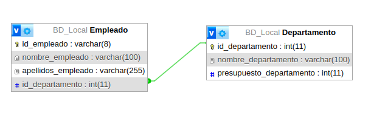
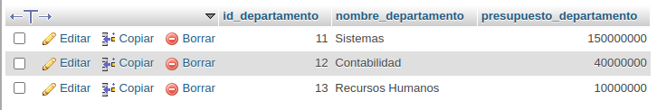
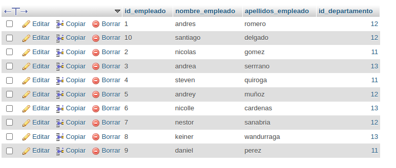
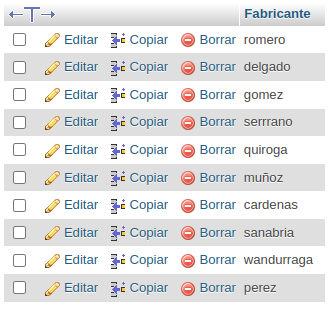

# Consultas2_SQL

 .

-------------------------------------------

 .

-------------------------------------------

 .

-------------------------------------------

1. Obtener la lista de los apellidos de empleados
`SELECT apellidos_empleado AS Fabricante FROM Empleado`
