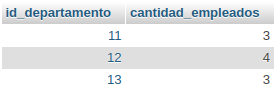

# Consultas2_SQL

 .

-------------------------------------------

 .

-------------------------------------------

 .

-------------------------------------------

1. Obtener la lista de los apellidos de empleados
`SELECT apellidos_empleado AS Fabricante FROM Empleado`

-------------------------------------------

2. Obtener los apellidos de todos los empleados sin repeticiones 
`SELECT DISTINCT apellidos_empleado FROM Empleado;`

-------------------------------------------

3. Obtener los apellidos de todos los empleados sin repeticiones 
`SELECT * FROM Empleado WHERE apellidos_empleado = 'gomez';`

-------------------------------------------

4. Obtener todos los datos de los empleados que se apellidan "Diaz" y los que se apellidan "Rodriguez".  Usar OR o IN
`SELECT * FROM Empleado WHERE apellidos_empleado = 'diaz' OR apellidos_empleado = 'rodriguez';`

-------------------------------------------

5. Obtener los nombres de los empleados que trabajan en el departamento 11
`SELECT nombre_empleado FROM Empleado WHERE id_departamento = 11;`

-------------------------------------------

6. Obtener todos los datos de los empleados cuyo apellido empiece por 'P'
`SELECT * FROM Empleado WHERE apellidos_empleado LIKE 'P%';`

-------------------------------------------

7. Obtener el presupuesto total de todos los departamentos.

`SELECT SUM(presupuesto_departamento) AS presupuesto_total FROM Departamento;`

-------------------------------------------

8. Obtener el número de empleados de cada departamento.

`SELECT id_departamento, COUNT(*) AS cantidad_empleados FROM Empleado GROUP BY id_departamento;`

-------------------------------------------

9. Obtener un listado completo de empleados, incluyendo por cada empleado los datos del empleado y de su departamento.
`SELECT * FROM Empleado e JOIN Departamento d ON e.id_departamento = d.id_departamento;`

-------------------------------------------

10. Obtener un listado completo de empleados, incluyendo el nombre y apellidos del empleado junto al nombre y presupuesto de su departamento.           
`SELECT Empleado.nombre_empleado, Empleado.apellidos_empleado, Departamento.nombre_departamento, Departamento.presupuesto_departamento FROM Empleado JOIN Departamento ON Empleado.id_departamento = Departamento.id_departamento;`

-------------------------------------------

11. Obtener los nombres y apellidos de los empleados que trabajen en departamentos cuyo presupuesto sea mayor a 100000000          
`SELECT Empleado.nombre_empleado, Empleado.apellidos_empleado FROM Empleado JOIN Departamento ON Empleado.id_departamento = Departamento.id_departamento WHERE Departamento.presupuesto_departamento > 100000000;`

